# Hexagonal Network Rotation System

## Overview

The hexagonal neural network uses a **single global weight matrix** (`global_W`) that is shared across all 6 rotational views. Each rotation provides a different **masked perspective** of this shared matrix, creating 6 different feedforward network topologies from the same underlying weights.

## Core Concepts

### 1. Global Weight Matrix (`global_W`)

The `global_W` is a **symmetric, all-to-all adjacency matrix** of size `(total_nodes, total_nodes)` where:
- `total_nodes = sum(hex_layer_sizes(n))` for a given `n`
- For `n=3`: `total_nodes = 3 + 4 + 5 + 4 + 3 = 19`
- The matrix is initialized as symmetric: `W = W + W.T`

**Key Property:** This single matrix contains weights for **all possible connections** between nodes, regardless of rotation.

### 2. Rotational Views (`dir_W`)

Each rotation `r ∈ {0, 1, 2, 3, 4, 5}` has its own directional weight matrix `dir_W[r]` which is a **masked view** of `global_W`. The masking enforces a layered feedforward structure:

- Only connections between **consecutive layers** for rotation `r` are active
- All other connections are zero (masked out)
- The active connections are **copied** from `global_W`, not independent

#### Table of Rotation Views

<!--
Reference: For visually exploring all rotations for n=3, the following table summarizes their reference files.
Images are styled for browser viewing and will be auto-scaled to fit typical page widths (max 240px wide per image).
-->

<table>
  <thead>
    <tr>
      <th style="text-align:center">Rotation</th>
      <th style="text-align:center">Physical Structure</th>
      <th style="text-align:center">Activation Pattern</th>
      <th style="text-align:center">Weight Matrix</th>
    </tr>
  </thead>
  <tbody>
    <tr>
      <td style="text-align:center"><b>r = 0</b></td>
      <td style="text-align:center">
        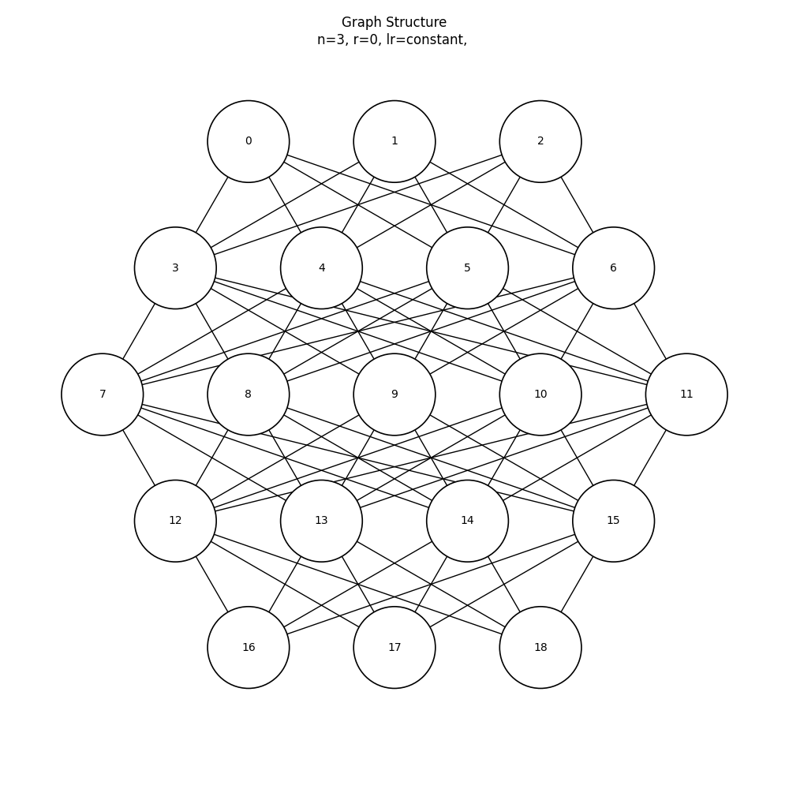
      </td>
      <td style="text-align:center">
        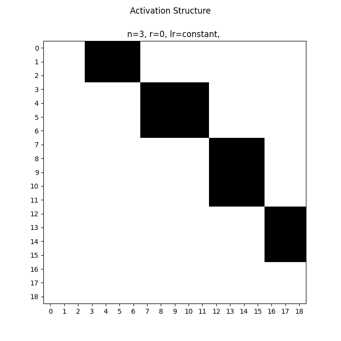
      </td>
      <td style="text-align:center">
        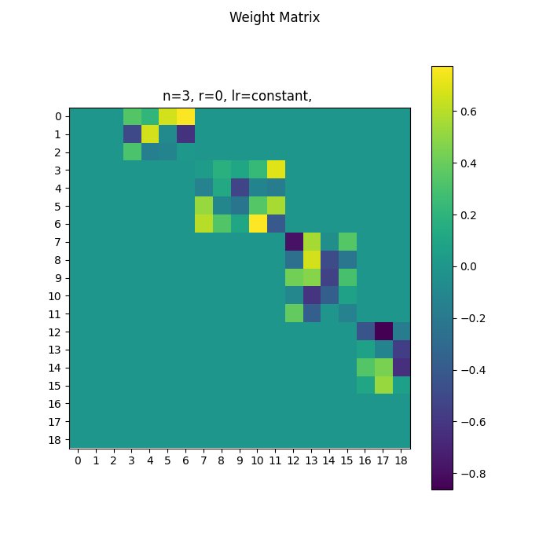
      </td>
    </tr>
    <tr>
      <td style="text-align:center"><b>r = 1</b></td>
      <td style="text-align:center">
        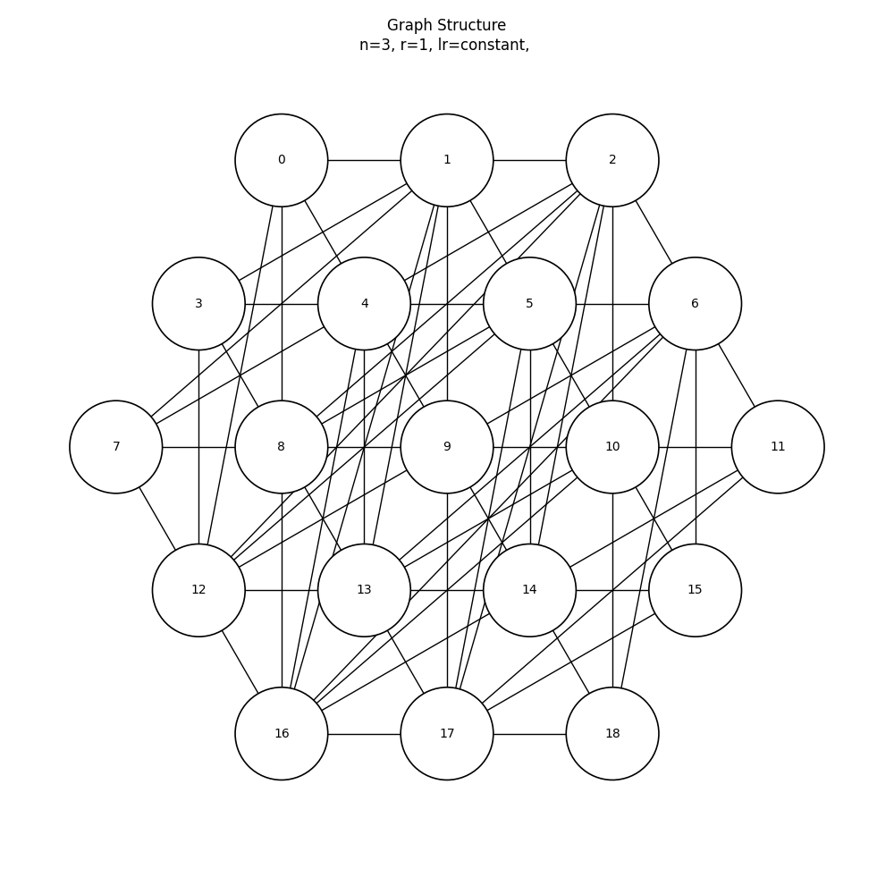
      </td>
      <td style="text-align:center">
        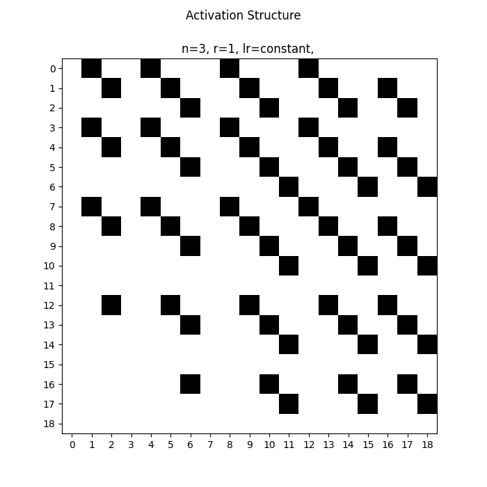
      </td>
      <td style="text-align:center">
        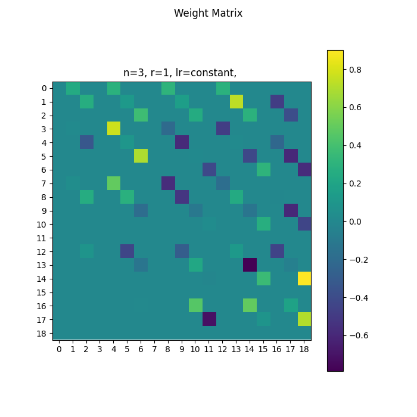
      </td>
    </tr>
    <tr>
      <td style="text-align:center"><b>r = 2</b></td>
      <td style="text-align:center">
        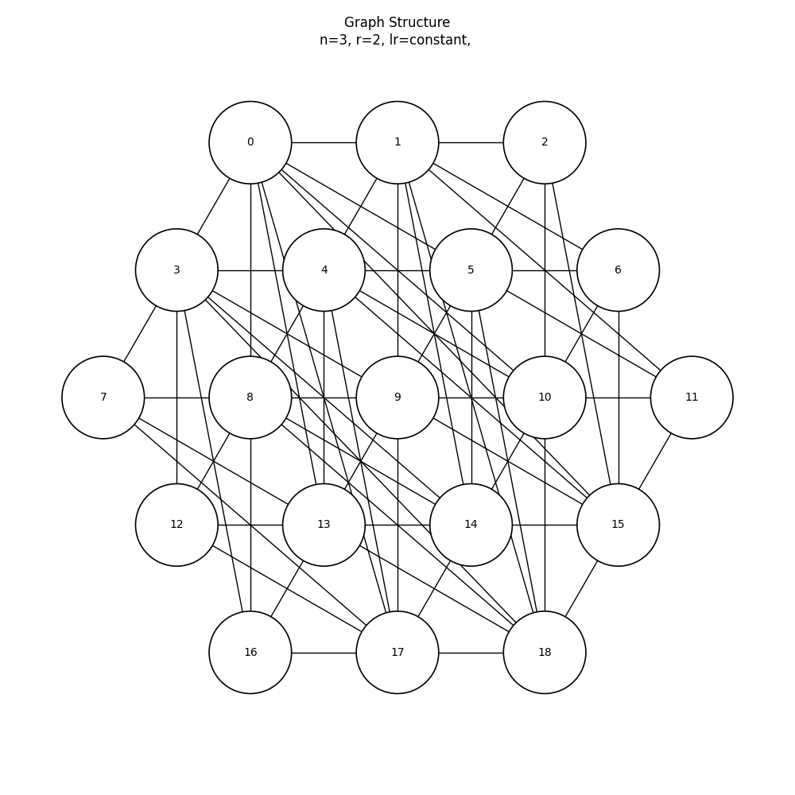
      </td>
      <td style="text-align:center">
        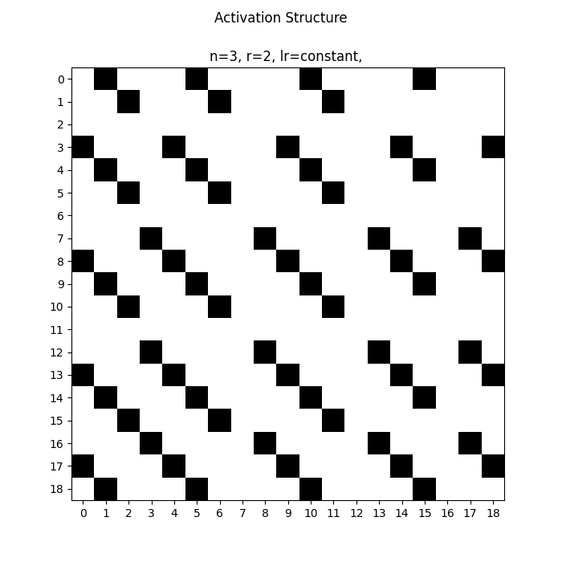
      </td>
      <td style="text-align:center">
        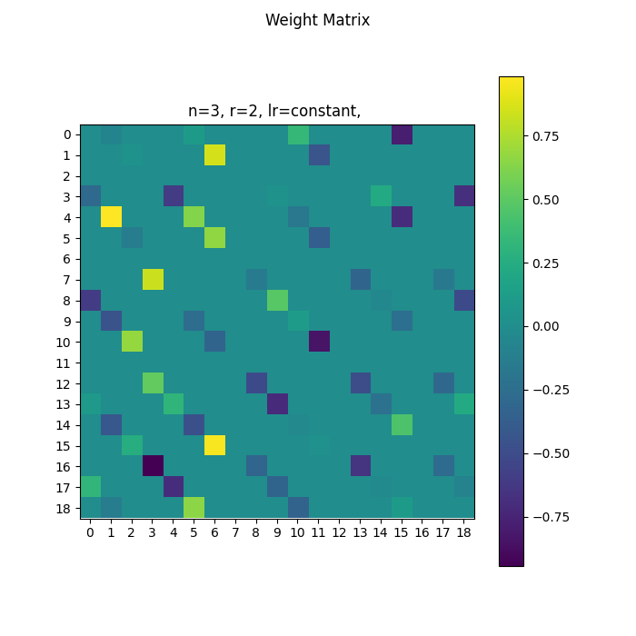
      </td>
    </tr>
    <tr>
      <td style="text-align:center"><b>r = 3</b></td>
      <td style="text-align:center">
        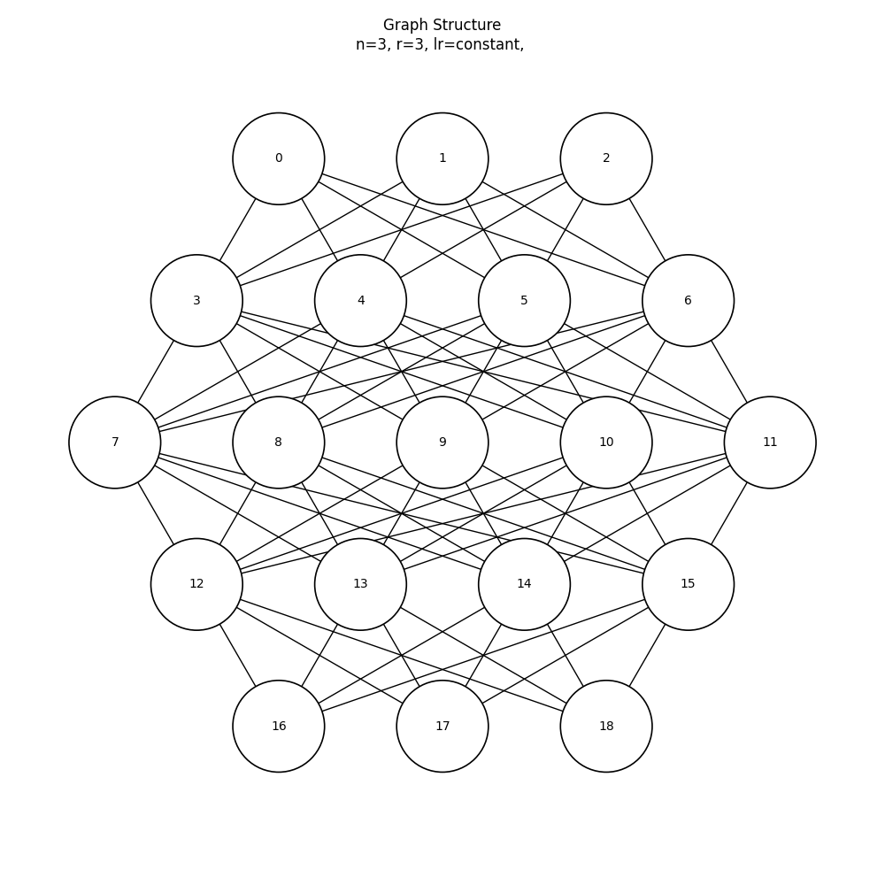
      </td>
      <td style="text-align:center">
        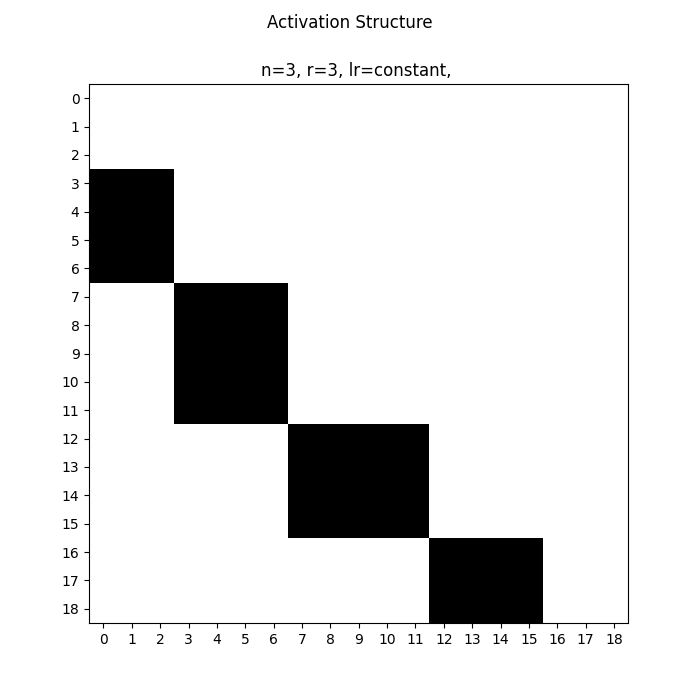
      </td>
      <td style="text-align:center">
        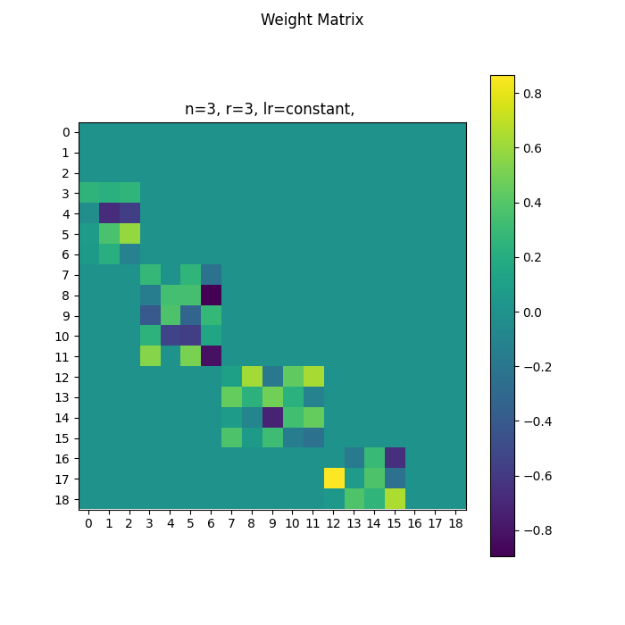
      </td>
    </tr>
    <tr>
      <td style="text-align:center"><b>r = 4</b></td>
      <td style="text-align:center">
        
      </td>
      <td style="text-align:center">
        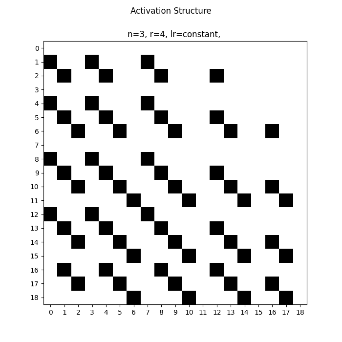
      </td>
      <td style="text-align:center">
        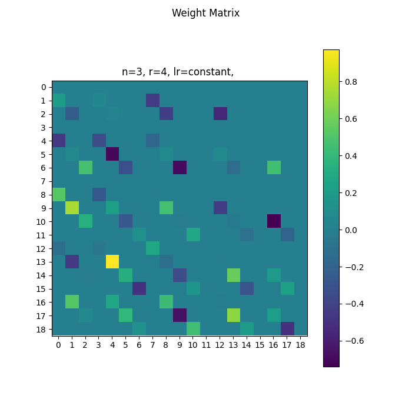
      </td>
    </tr>
    <tr>
      <td style="text-align:center"><b>r = 5</b></td>
      <td style="text-align:center">
        
      </td>
      <td style="text-align:center">
        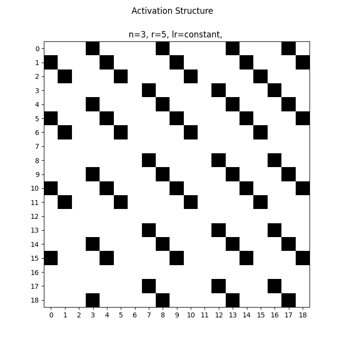
      </td>
      <td style="text-align:center">
        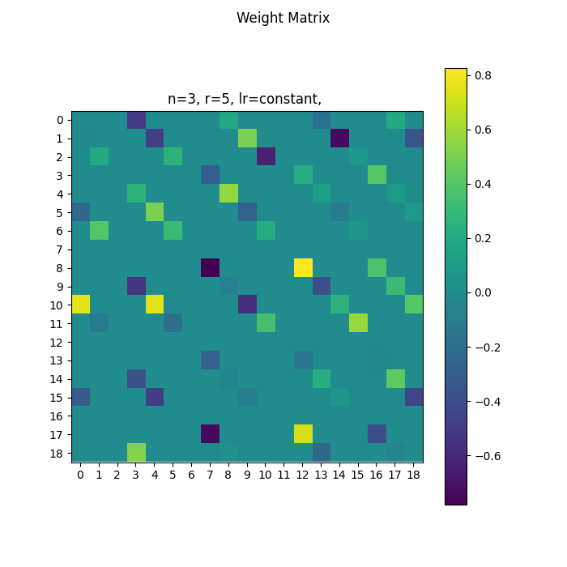
      </td>
    </tr>
  </tbody>
</table>

<p align="center" style="font-size:80%">All files are generated by <code>hexnet ref ...</code> for <b>n=3</b>. Images will shrink-to-fit this page and should remain viewable even on mobile or small browser windows. See <a href="./REFERENCE_FILES.md">REFERENCE_FILES.md</a> for filenames and further details.</p>

### 3. Layer Indices (`indices`)

Each rotation defines a different **layer structure** via `_get_layer_indices(n, r)`, which partitions the `total_nodes` into layers:

- **Rotation 0 (r=0):** Top-to-bottom layers (default hexagonal structure)
- **Rotation 1 (r=1):** Top-right to bottom-left diagonal
- **Rotation 2 (r=2):** Top-left to bottom-right diagonal (reversed)
- **Rotation 3 (r=3):** Bottom-to-top (rotation 0 reversed)
- **Rotation 4 (r=4):** Bottom-left to top-right diagonal
- **Rotation 5 (r=5):** Bottom-right to top-left diagonal

For `n=3`, the layer sizes are: `[3, 4, 5, 4, 3]` (total 5 layers, 19 nodes).

## Implementation Details

### Weight Matrix Synchronization

```python
def _sync_global_to_dir(self):
    """Copy weights from global_W to dir_W[r] for all rotations."""
    for r in range(0, 6):
        r_layer_matrices = self.dir_W[r]["indices"]
        for j in range(len(r_layer_matrices) - 1):
            for u in r_layer_matrices[j]:        # Source layer nodes
                for v in r_layer_matrices[j + 1]:  # Destination layer nodes
                    self.dir_W[r]["W"][u, v] = self.global_W[u, v]
```

**What this does:**
- For each rotation `r`, iterate through consecutive layer pairs
- Copy weights from `global_W[u, v]` to `dir_W[r]["W"][u, v]` only for connections between consecutive layers
- All other entries in `dir_W[r]["W"]` remain zero (masked out)

**Result:** Each `dir_W[r]["W"]` is a sparse matrix with non-zero entries only for the feedforward connections of that rotation.

### Forward Propagation with Padded Vectors

Forward propagation uses **padded vectors** that span all `total_nodes`, but only the nodes in the active layers for rotation `r` contain non-zero values:

```python
def pad_input(self, x):
    """Pad input to full node space, placing x in first layer of rotation r."""
    x0 = np.zeros(self.total_nodes)
    x0[self.dir_W[self.r]["indices"][0]] = x  # Only first layer nodes are non-zero
    return x0

def forward(self, x: np.ndarray) -> np.ndarray:
    """Forward pass using rotation r's masked weight matrix."""
    activations = [x.copy()]  # x is already padded
    a = x.copy()
    for i in range(len(self.dir_W[self.r]["indices"]) - 1):
        z = self.dir_W[self.r]["W"].T @ a  # Matrix-vector multiply with masked W
        if i < len(self.dir_W[self.r]["indices"]) - 2:
            a = self.activation.activate(z)
        else:
            a = z  # No activation on output layer
        activations.append(a.copy())
    return activations
```

**Key Points:**
1. **Input padding:** Input `x` (size `n`) is padded to size `total_nodes` with zeros everywhere except the first layer nodes for rotation `r`
2. **Matrix multiplication:** `dir_W[r]["W"].T @ a` uses the **masked weight matrix** for rotation `r`
3. **Sparse computation:** Even though vectors are size `total_nodes`, only the active nodes for rotation `r` participate in computation
4. **Layer-by-layer:** Each iteration processes one layer transition, following the layer structure defined by `dir_W[r]["indices"]`

**Example for n=3, r=0:**
- Input: `x = [x0, x1, x2]` (size 3)
- Padded: `x_padded = [x0, x1, x2, 0, 0, 0, ..., 0]` (size 19, only first 3 non-zero)
- Layer 0 → Layer 1: Uses `dir_W[0]["W"][0:3, 3:7]` (connections from nodes 0-2 to nodes 3-6)
- Layer 1 → Layer 2: Uses `dir_W[0]["W"][3:7, 7:12]` (connections from nodes 3-6 to nodes 7-11)
- And so on...

### Backward Propagation

Backward propagation follows the same masked structure:

```python
def backward(self, activations: np.ndarray, target: np.ndarray, apply_delta_W: bool = True):
    """Backward pass accumulates gradients in dir_W[r]["delta_W"]."""
    grads = np.zeros_like(self.dir_W[self.r]["W"])
    delta = self.loss.calc_delta(target, activations[-1])
    
    # Walk layers backward
    for i in reversed(range(len(self.dir_W[self.r]["indices"]) - 1)):
        src_nodes = self.dir_W[self.r]["indices"][i]
        dst_nodes = self.dir_W[self.r]["indices"][i + 1]
        
        # Compute weight gradients (only for active connections)
        for u in src_nodes:
            for v in dst_nodes:
                grads[u, v] += delta[v] * activations[i][u]
        
        # Backpropagate delta to previous layer
        if i > 0:
            new_delta = np.zeros(len(activations[i]))
            for u in src_nodes:
                s = 0.0
                for v in dst_nodes:
                    s += self.dir_W[self.r]["W"][u, v] * delta[v]
                new_delta[u] = s * self.activation.deactivate(activations[i][u])
            delta = new_delta
    
    # Accumulate gradients in rotation-specific delta_W
    self.dir_W[self.r]["delta_W"] += grads
```

**Key Points:**
1. **Gradient accumulation:** Gradients are accumulated in `dir_W[r]["delta_W"]`, which has the same sparsity pattern as `dir_W[r]["W"]`
2. **Only active connections:** Gradients are computed only for connections between consecutive layers in rotation `r`
3. **Backpropagation:** Delta is backpropagated through the layer structure defined by `dir_W[r]["indices"]`

### Rotation Switching

When switching rotations, the current rotation's accumulated gradients are applied to `global_W`, then the new rotation's weight matrix is synced:

```python
def apply_delta_W(self):
    """Apply accumulated gradients to both dir_W[r] and global_W."""
    current_rate = self.learning_rate_fn.rate_at_iteration(self.data_iteration)
    
    # Update rotation-specific weight matrix
    self.dir_W[self.r]["W"] -= current_rate * self.dir_W[self.r]["delta_W"]
    
    # Update global weight matrix (symmetric update)
    self.global_W -= current_rate * self.dir_W[self.r]["delta_W"]
    self.global_W -= current_rate * self.dir_W[self.r]["delta_W"].T
    
    # Clear accumulated gradients
    self.dir_W[self.r]["delta_W"].fill(0)

def rotate(self, direction):
    """Switch to a new rotation."""
    assert 0 <= direction <= 5, f"Invalid rotation: {direction}"
    
    # Apply any pending gradients from current rotation
    # (This should be called before rotate if needed)
    
    # Switch rotation
    self.r = direction % 6
    
    # Sync global weights to new rotation's view
    self._sync_global_to_dir()
```

**Rotation Workflow:**
1. **Train with rotation r:** Accumulate gradients in `dir_W[r]["delta_W"]`
2. **Apply gradients:** Call `apply_delta_W()` to update both `dir_W[r]["W"]` and `global_W`
3. **Switch rotation:** Call `rotate(new_r)` to change `self.r` and sync `dir_W[new_r]["W"]` from `global_W`
4. **Continue training:** New rotation sees the updated weights from previous rotations

**Key Insight:** All rotations share the same `global_W`, so training in one rotation affects all others. The rotation-specific `dir_W[r]["W"]` matrices are just **views** of `global_W` with different masks.

## Visual Representation

### For n=3 (19 nodes, 5 layers)

**Rotation 0 (r=0) - Top to Bottom:**
```
Layer 0: [0, 1, 2]           (3 nodes)
Layer 1: [3, 4, 5, 6]         (4 nodes)
Layer 2: [7, 8, 9, 10, 11]    (5 nodes)
Layer 3: [12, 13, 14, 15]     (4 nodes)
Layer 4: [16, 17, 18]         (3 nodes)
```

**Rotation 1 (r=1) - Top-Right to Bottom-Left:**
```
Different layer partitioning of the same 19 nodes
```

The `dir_W[0]["W"]` matrix has non-zero entries only for:
- `W[0:3, 3:7]` (Layer 0 → Layer 1)
- `W[3:7, 7:12]` (Layer 1 → Layer 2)
- `W[7:12, 12:16]` (Layer 2 → Layer 3)
- `W[12:16, 16:19]` (Layer 3 → Layer 4)

All other entries are zero (masked out).

## Reference Graphs

Reference graphs visualize the structure and weights for different rotations. See [REFERENCE_FILES.md](./REFERENCE_FILES.md) for a complete catalog of generated reference files.

### Graph Types

1. **`structure_matplotlib`**: Visual graph showing nodes and edges for a specific rotation
2. **`structure_dot`**: Graphviz DOT format graph
3. **`activation`**: Binary activation matrix showing which connections are active (sparsity pattern)
4. **`weight`**: Full weight matrix visualization (shows actual weight values)
5. **`multi_activation`**: Overlay of all 6 rotations' activation patterns
6. **`layer_indices_terminal`**: Text output showing layer node assignments

### File Naming Convention

Reference files follow the pattern:
- `hexnet_n{n}_r{r}_structure.png` - Structure graph for rotation r
- `hexnet_n{n}_r{r}_Activation_Structure.png` - Activation pattern
- `hexnet_n{n}_r{r}_Weight_Matrix.png` - Weight matrix
- `hexnet_n{n}_multi_activation.png` - Multi-rotation overlay

## Training with Multiple Rotations

The hexagonal network can be trained by alternating between rotations:

```python
net = HexagonalNeuralNetwork(n=3, r=0)

for epoch in range(epochs):
    for rotation in range(6):
        net.rotate(rotation)  # Switch to rotation
        data = get_dataset(n=3, ...)
        net.train(data, epochs=1)  # Train one epoch with this rotation
```

**What happens:**
1. Each rotation accumulates gradients in its own `dir_W[r]["delta_W"]`
2. When `apply_delta_W()` is called, gradients are applied to `global_W`
3. When rotating, the new rotation's `dir_W[new_r]["W"]` is synced from the updated `global_W`
4. All rotations benefit from training in any single rotation

This creates a form of **multi-view learning** where the same underlying weight matrix is optimized for multiple feedforward topologies simultaneously.
